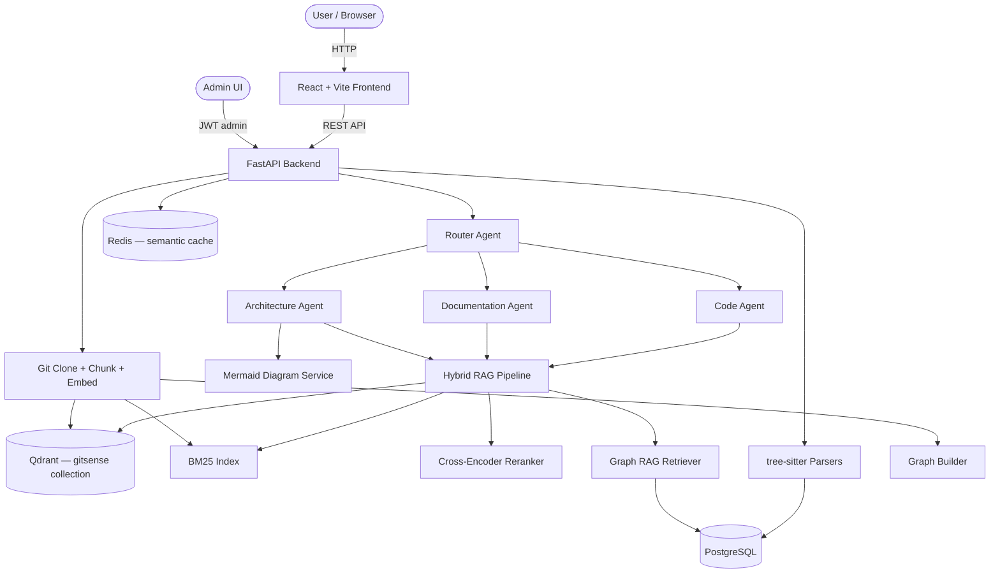
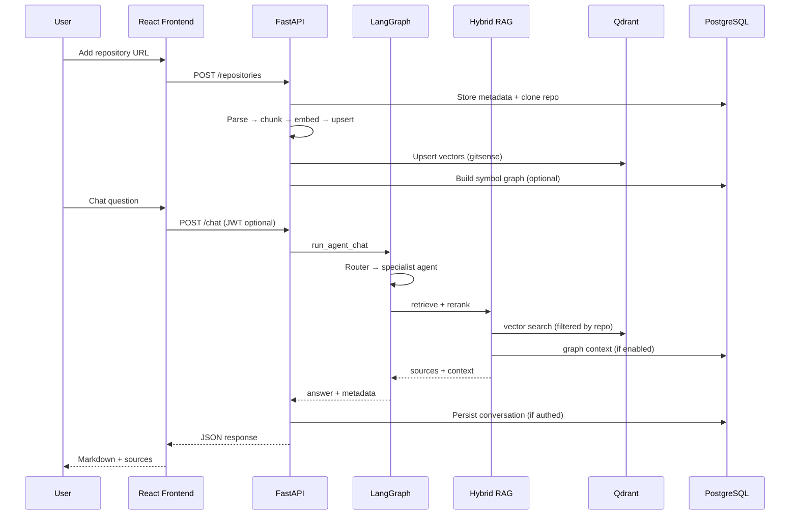

# GitSense AI 🧠📦

**Agentic Software Intelligence Platform** — index GitHub repositories, reason over code with multi-agent RAG, Graph RAG, hybrid search, and an internal admin ops console.

## Project Overview

GitSense AI is a production-oriented platform for understanding large software repositories through natural language. It clones and parses GitHub repos (tree-sitter for Go, Python, JavaScript, TypeScript), chunks and embeds source code into **Qdrant**, builds a **BM25** index for hybrid retrieval, and optionally constructs a **symbol/file graph** in PostgreSQL for Graph RAG. A **LangGraph** workflow routes questions to specialized agents (Code, Documentation, Architecture), generates **Mermaid** diagrams on demand, and persists chat history for authenticated users.

## Features

- **Repository lifecycle**: Submit GitHub URLs, clone, parse, re-index, delete — with per-user scoping when auth is enabled.
- **Multi-agent chat**: Router agent delegates to Code, Documentation, or Architecture specialists via LangGraph.
- **Hybrid retrieval**: Vector search (Qdrant) + BM25 fusion + cross-encoder reranking for production-quality RAG.
- **Graph RAG**: Import/call graph stored in Postgres; graph context augments answers for architecture and dependency questions.
- **Mermaid diagrams**: Architecture and import-dependency diagrams generated from the repo graph or LLM fallback.
- **Semantic cache**: Redis-backed cache for similar single-turn questions (with admin analytics).
- **Multi-repo search**: Semantic search across all repositories accessible to the signed-in user.
- **JWT authentication**: Register/login, saved conversations, conversation delete, repo ownership.
- **Admin console** (`admin@gmail.com`): Ops dashboard, retrieval lab, Graph RAG lab, cache analytics — platform-wide repo view with owner labels.
- **Containerized stack**: Docker Compose for frontend, backend, Postgres, Redis, and Qdrant.

## Tech Stack

- **Languages**: Python 3.12, TypeScript
- **Frontend**: React, Vite, Tailwind CSS, React Router, React Query, Axios, React Markdown, Lucide React
- **Backend**: FastAPI, Uvicorn, Pydantic Settings, psycopg
- **AI / agents**: LangGraph, LangChain, OpenAI / Ollama, Sentence Transformers (`all-MiniLM-L6-v2`)
- **Retrieval**: Qdrant, BM25 (LangChain), hybrid RRF fusion, cross-encoder rerank
- **Parsing**: tree-sitter (Go, Python, JavaScript, TypeScript)
- **Databases**: PostgreSQL (metadata, graph, users, conversations), Redis (cache), Qdrant (vectors)
- **Infrastructure**: Docker, Docker Compose, Make
- **Auth**: JWT (PyJWT), bcrypt password hashing

## System Architecture



## Multi-Agent Workflow

1. **Router Agent**: Classifies the user question (regex hints + optional LLM) into `code`, `documentation`, or `architecture`; diagram requests route to Architecture.
2. **Code Agent**: Hybrid RAG over repository chunks — answers implementation and “where is X defined?” questions.
3. **Documentation Agent**: Same RAG stack with documentation-oriented prompting.
4. **Architecture Agent**: Graph-augmented RAG for system design questions; can emit publishable Mermaid diagrams when the user asks for a diagram.

## Project Flow



## Folder Structure

```text
.
├── backend/                 # FastAPI app, agents, RAG, parsers, vector store
│   ├── api/routes/          # REST endpoints (chat, repos, auth, admin, …)
│   ├── agents/              # LangGraph router + specialist agents
│   ├── auth/                # JWT dependencies and security
│   ├── cache/               # Semantic cache + analytics
│   ├── diagrams/            # Mermaid generation and validation
│   ├── graph_rag/           # Graph build, store, retrieval
│   ├── parsers/             # tree-sitter parsing pipeline
│   ├── rag/                 # Hybrid search, reranker, chat pipeline
│   ├── services/            # Business logic (repos, chat, conversations)
│   ├── vector_store/        # Chunking, embeddings, Qdrant client
│   ├── db/                  # PostgreSQL schema + connection
│   ├── config.py            # Settings (Pydantic)
│   └── main.py              # App entry point
├── frontend/                # React SPA
│   └── src/
│       ├── pages/           # Chat, Repositories, Search, Admin, Auth
│       ├── components/      # UI components + admin layout
│       └── api/             # Axios API clients
├── docker/                  # Backend and frontend Dockerfiles
├── docs/                    # Architecture docs, QnA, learnings
├── docker-compose.yml       # Full local stack
├── Makefile                 # dev and Docker commands
├── .env.example             # Environment template
└── README.md
```

## Installation

### Prerequisites

| Tool | Version | Notes |
|------|---------|--------|
| **Node.js** | `^20.19.0` or `>=22.12.0` | Frontend (`make frontend` uses Node 22.12.0 via nvm) |
| **Python** | `3.12` | Backend |
| **Git** | Latest | Repository cloning |
| **PostgreSQL** | `16` | Metadata, graph, auth |
| **Make** | Latest | Convenience commands |
| **Docker + Docker Compose** | Latest | Recommended full stack |
| **Ollama** (optional) | Latest | Local LLM when `LLM_PROVIDER=ollama` |

Redis and Qdrant are included in Docker Compose; for local backend-only dev you can point `.env` to published ports on `localhost`.

### Setup Steps

1. Clone the repository:

   ```bash
   git clone https://github.com/yourusername/gitsense-ai.git
   cd gitsense-ai
   ```

2. Create environment file:

   ```bash
   cp .env.example .env
   ```

   Edit `.env` for your setup (see below).

3. **Option A — Docker (recommended)**

   ```bash
   make docker-up
   ```

   Use Docker service hostnames in `.env` (`postgres`, `redis`, `qdrant`).

   Use `localhost` hostnames in `.env` for Postgres, Redis, and Qdrant.

## Environment Variables

Create a `.env` file in the project root.

### Docker Compose (`make docker-up`)

Backend runs **inside** the compose network — use service names:

```env
FRONTEND_ORIGIN=http://localhost:5173

POSTGRES_DB=gitsense
POSTGRES_USER=gitsense
POSTGRES_PASSWORD=gitsense
POSTGRES_HOST=postgres
POSTGRES_PORT=5432

REDIS_URL=redis://redis:6379/0
QDRANT_URL=http://qdrant:6333
REPOSITORY_CLONE_DIR=app/data/repos

# LLM — Ollama on the host machine
LLM_PROVIDER=ollama
OLLAMA_BASE_URL=http://host.docker.internal:11434
OLLAMA_MODEL=llama3.2

# Auth
AUTH_ENABLED=true
ADMIN_EMAIL=admin@gmail.com
JWT_SECRET=change-me-use-a-long-random-string
JWT_ALGORITHM=HS256
JWT_EXPIRE_MINUTES=10080

# Retrieval & agents
HYBRID_SEARCH_ENABLED=true
RERANK_ENABLED=true
GRAPH_RAG_ENABLED=true
AGENTS_ENABLED=true
SEMANTIC_CACHE_ENABLED=true
```

From your **Mac/browser**, services are still reached via **published ports**:

| Service | URL on host |
|---------|-------------|
| Frontend | http://localhost:5173 |
| Backend API | http://localhost:8000 |
| Qdrant UI | http://localhost:6333/dashboard |
| PostgreSQL | localhost:5432 |
| Redis | localhost:6379 |


**Rule:** URLs in `.env` are read by the **backend process**. Container → container uses Docker names; Mac → services uses `localhost`.

## Running the Project

### Using Docker (recommended)

```bash
make docker-up
```

Stop:

```bash
make docker-down
```

Logs:

```bash
make docker-logs
```

**API docs:** http://localhost:8000/docs

**Admin console:** sign in as `admin@gmail.com` → redirected to http://localhost:5173/admin/ops


## Future Enhancements

- Real-time GitHub webhook indexing and incremental updates.
- MCP-compatible tool layer for clone, search, and test execution.
- Kubernetes deployment manifests and CI/CD pipelines.
- Streaming chat responses and Socket.io live updates.
- Organization-level multi-tenant admin and usage analytics.
- Prometheus / Grafana monitoring and LangSmith tracing.

## Contributing

Contributions are welcome:

1. Fork the repository.
2. Create a feature branch (`git checkout -b feature/your-feature`).
3. Commit your changes (`git commit -m 'Add your feature'`).
4. Push to the branch (`git push origin feature/your-feature`).
5. Open a Pull Request.
